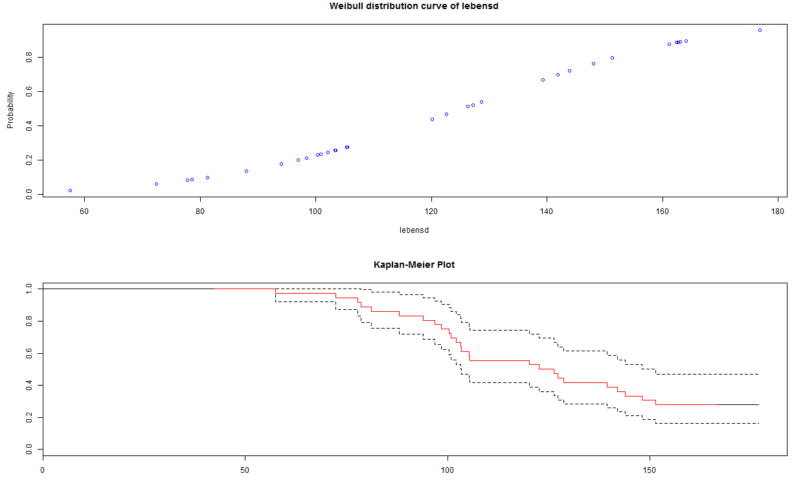

# Rechnungsmodell-basiert-auf-R
Das Projekt hier ist meine Masterarbeit. Es ist eine Web-Anwendung, die mit R-Sprache und ihrem Web-Framework Shiny aufgebaut wurde. Die Anwendung laüft unter der Entwicklungsumgebung RStudio mit Localhost. Die originale UI sieht wie folgende aus.

Wie oben gezeigt, man kann externe Dokumente bei dieser Anwendung hochladen. Die akzeptabele Type von Dokumenten hier wurde auf CSV-Dokument eingeschränkt. Ein paar Beispieldokumenten befinden sich auch in diesem Repository. Um das hochzuladende Dokument richtig einlesen zu können, muss ein richtiger Separator aus Komma, Semikolon und Tab ausgewählt werden.

Nach der Hochladung vom Dokument kann der Inhalt des Dokumentes dargestellt werden. Die Menge der darzustellenden Daten ist konfigurierbar und hier wurde als 10 vorgegeben.

Unter dem Reiter "Summary" wird die Inhaltsangabe dargestellt.

Unter dem Reiter "Parameters Estimation" werden die Parameter von mehreren Verteilungen unter ML-Methode geschätzt. Dabei kann man eine Datengruppe auswählen als die Statusdaten der Zensierung in der Schätzungsarbeit einzusetzen, wenn keine Daten wahrgenommen wird, handelt es sich hier nur um die allgemeine Situation. Um die Schätzungsergebnisse schauen zu können, muss man die allen Konfigurierungen noch durch den Knopf "Confirm" sicherstellen. 

Unter Dem Reiter "Plot" wird die Daten grafischerweise dargestellt. Außer den allgemeinen Grafiken wie Histogramm, Boxplot, Verteilungskurve, etc. wird ein Kaplan-Meier-Plot hier auch generiert, jedoch nur wenn eine angemessene Zensiterungsdaten ausgeführt wurde.

Noch eine kernfunktion der Anwendung wird unter "Avalibility extimation and graph of systems" dargestellt. Nachdem dieser Reiter aktiviert wurde, tauchen die entsprechenden UI-Widgets in dem linken Paneel auf. In den Textbereich kann man die Auddruckformel wie z.B. "P(1,S(2,3))" eingeben, um ein System aufzubauen. Mit der ausgewählten Verteilungsfunktion kann die Ausschussfunktion des Systems und die Dichtkurve davon automatisch generiert werden. Stattdessen die von ML-Methode optimierten Parameter darf Man hier auch die Parameter der Vertielung und die Beobachtungsdauer flexibel stellen, damit die Ergebnisse bzw. die Verfügbarkeit des systems etc. beeinflusst werden. 

Man kann mich hier dafür frei entscheiden, eine statische oder dynamische Grafik herzustellen.

Statsiche Grafik: 

Dynamische Grafik: 
